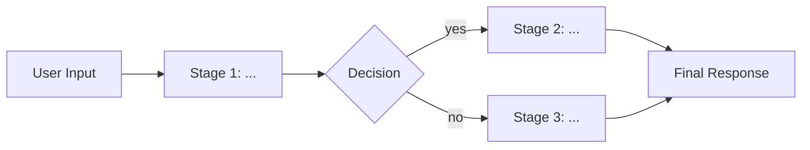
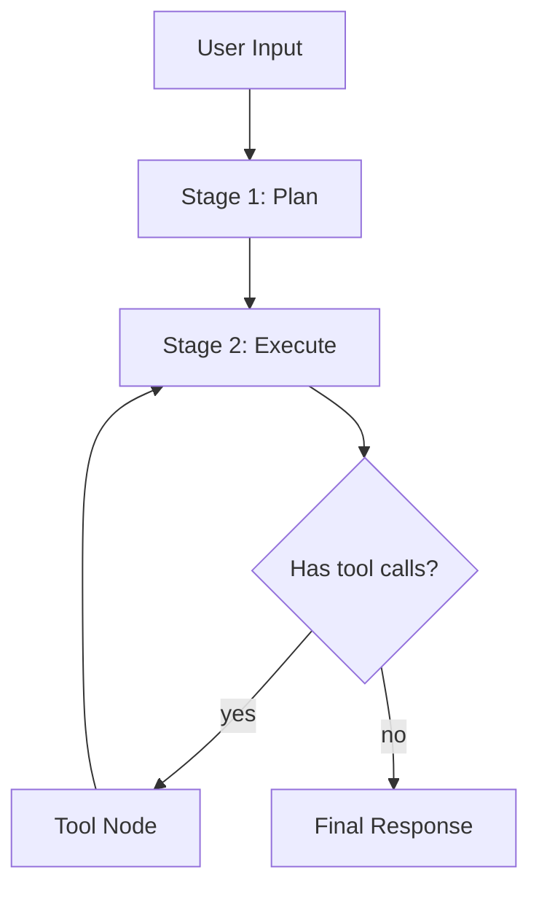
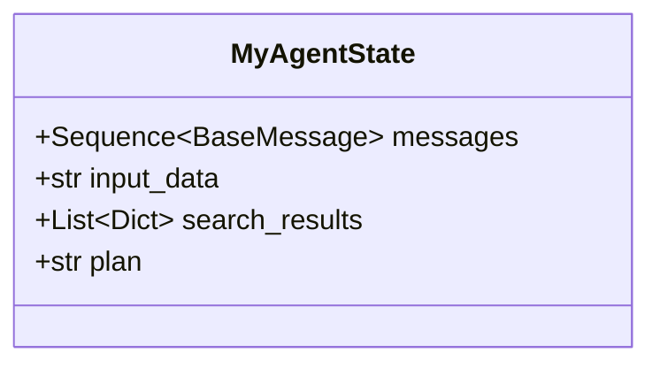
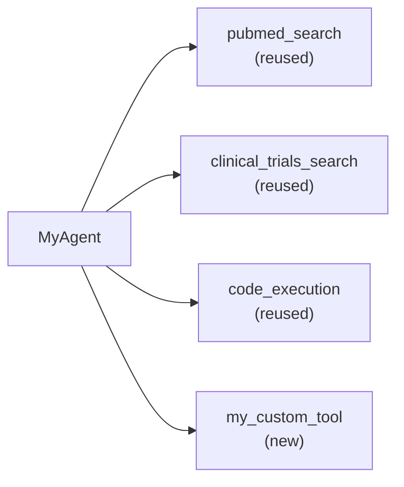
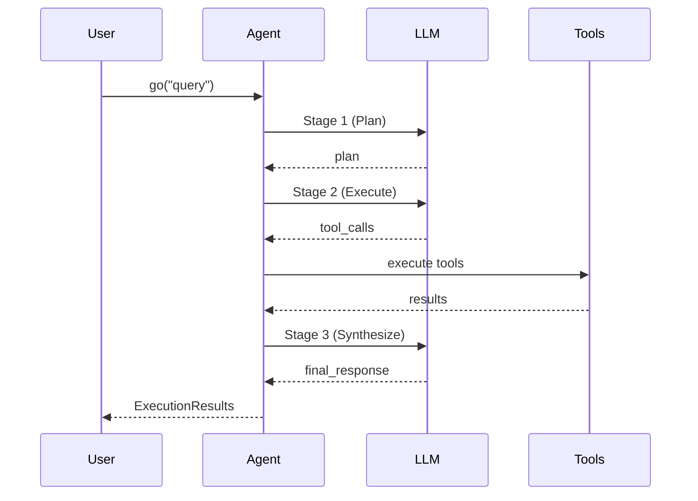

# 05 — Deliverables, Run Scripts, and Sanity Checks

This guide defines what a completed agent prototype looks like, how to create a run script, and how to validate that the agent works. It also covers the **design proposal** step (present before implementing) and the **design document** deliverable (produced alongside the agent code).

---

## Step 0: Design Proposal (Before Implementation)

**IMPORTANT**: Before writing any code, present a design proposal to the user and wait for confirmation.

### Why

Users often have a high-level idea ("build an agent that does X") but the implementation has many design choices. Proposing first:
- Catches misunderstandings early (saves wasted work)
- Makes the agent's architecture transparent to the user
- Gives the user a chance to steer tool selection, workflow structure, and scope
- Produces better agents by incorporating domain knowledge the user has but didn't mention

### Proposal Template

Present the following to the user in a single message:

```markdown
## Design Proposal: <AgentName>

### Understanding
<Restate the user's goal in your own words. Be specific about what the agent will DO.>

### Recommended Pattern
<Which BioDSA pattern and why>
- **Pattern**: <ReAct loop / Multi-stage pipeline / Orchestrator + sub-agents / Meeting system>
- **Rationale**: <Why this pattern fits>

### Proposed Workflow
<Mermaid diagram or text description of the graph nodes and edges>



### Tools
| Tool | Source | Purpose |
|------|--------|---------|
| <tool_name> | `biodsa/tools/<kb>/` (reuse) | <what it does> |
| <tool_name> | `biodsa/tool_wrappers/<name>` (reuse) | <what it does> |
| <new_tool_name> | New (agent-specific) | <what it does> |

### State Fields
| Field | Type | Purpose |
|-------|------|---------|
| `messages` | `Sequence[BaseMessage]` | Message history (required) |
| <field> | <type> | <purpose> |

### Input / Output
- **Input**: <What the user passes to `agent.go()`>
- **Output**: <What `final_response` contains>

### Open Questions
1. <Any ambiguity or design choice that needs user input>
2. <e.g., "Should X be a separate stage or handled in the same node?">

---
Shall I proceed with this design, or would you like to adjust anything?
```

### When to Skip the Proposal

You may skip the proposal and proceed directly to implementation if:
- The user already provided a very detailed specification (e.g., a full algorithm description with explicit stages)
- The user explicitly says "just build it" or "skip the design"
- It's a trivial modification to an existing agent (e.g., "add a new tool to DeepEvidence")

---

## What a Completed Agent Looks Like

### Folder Structure

A new agent named `my_agent` should produce:

```
biodsa/agents/my_agent/
├── __init__.py         # Export the agent class
├── agent.py            # Agent implementation (subclass of BaseAgent)
├── state.py            # LangGraph state definition (Pydantic BaseModel)
├── prompt.py           # System prompts as module-level constants
├── tools.py            # Agent-specific tools (BaseTool subclasses)
├── README.md           # Description of what the agent does, based-on paper, usage
└── DESIGN.md           # Architecture explanation with Mermaid diagrams
```

Plus at the repo root:

```
run_my_agent.py         # Example run script
```

### File-by-File Checklist

#### `__init__.py`

```python
from .agent import MyAgent

__all__ = ["MyAgent"]
```

#### `state.py`

```python
from pydantic import BaseModel, Field
from typing import List, Dict, Any, Optional, Annotated, Sequence
from langgraph.graph.message import add_messages, BaseMessage


class MyAgentState(BaseModel):
    """State for the MyAgent workflow."""
    # Required: message history with LangGraph reducer
    messages: Annotated[Sequence[BaseMessage], add_messages]

    # Add domain-specific fields:
    input_data: str = Field(default="", description="Original input")
    # ... more fields as needed ...
```

#### `prompt.py`

```python
SYSTEM_PROMPT = """You are a specialized agent for [domain].

# TASK
[What the agent should do]

# TOOLS
You have access to the following tools:
[Tool descriptions and usage guidance]

# OUTPUT FORMAT
[Expected output format]
"""

# Add more prompts for different stages if needed
ANALYSIS_PROMPT = """..."""
SYNTHESIS_PROMPT = """..."""
```

#### `tools.py`

```python
from typing import Type, List
from pydantic import BaseModel, Field
from langchain.tools import BaseTool


class MyToolInput(BaseModel):
    query: str = Field(description="...")


class MyTool(BaseTool):
    name: str = "my_tool"
    description: str = "..."
    args_schema: Type[BaseModel] = MyToolInput

    def _run(self, query: str) -> str:
        # Implementation
        return "result"


def get_my_agent_tools() -> List[BaseTool]:
    return [MyTool()]
```

#### `agent.py`

Must contain:
- Class inheriting from `BaseAgent`
- `name` class attribute
- `__init__` calling `super().__init__(...)` and building `self.agent_graph`
- `_create_agent_graph()` returning a compiled `StateGraph`
- `generate()` for streaming execution
- `go()` returning `ExecutionResults`

#### `README.md`

```markdown
# MyAgent

Brief description of what this agent does.

## Based On
[Paper reference if applicable]

## Usage
\```python
from biodsa.agents.my_agent import MyAgent
agent = MyAgent(model_name="gpt-4o", api_type="azure", ...)
results = agent.go("your input here")
print(results.final_response)
\```

## Architecture
[Description of the workflow stages/graph]

## Tools
[List of tools the agent uses]
```

#### `DESIGN.md`

This is a **required deliverable** — a brief architecture document with Mermaid diagrams that makes the agent transparent and easy to understand. It serves as both documentation and a visual audit trail of design decisions.

Use this template (replace placeholders):

````markdown
# MyAgent — Design Document

## Overview

**Purpose**: <One-sentence description of what this agent does and why>
**Pattern**: <ReAct loop / Multi-stage pipeline / Orchestrator + sub-agents / Meeting system>
**Based on**: <Paper citation or "original design">

## Workflow



## State



## Tools



| Tool | Source | Description |
|------|--------|-------------|
| `pubmed_search` | `biodsa/tool_wrappers/pubmed/` | Search PubMed for relevant papers |
| `clinical_trials_search` | `biodsa/tool_wrappers/clinical_trials/` | Search ClinicalTrials.gov |
| `code_execution` | `biodsa/tool_wrappers/code_exec_tool.py` | Execute Python in sandbox |
| `my_custom_tool` | `biodsa/agents/my_agent/tools.py` | Agent-specific tool |

## Decision Points

| Condition | Branch | Rationale |
|-----------|--------|-----------|
| LLM emits tool calls | → Tool Node | Need external data |
| No tool calls | → END | Agent has enough info to respond |
| Retry budget exceeded | → END with partial response | Prevent infinite loops |

## Input / Output

- **Input**: Natural language query describing <domain task>
- **Output**: `ExecutionResults` with:
  - `final_response`: Structured analysis / summary
  - `message_history`: Full conversation trace
  - `code_execution_results`: Any code outputs (if applicable)

## Design Decisions

1. **<Decision>**: <Why this choice was made>
2. **<Decision>**: <Alternative considered and why rejected>
````

### Mermaid Diagram Types to Use

Pick the right diagram type for what you're explaining:

| What to Show | Mermaid Type | Example |
|-------------|-------------|---------|
| Agent workflow (graph nodes, edges) | `graph TD` or `graph LR` | Flowchart of stages and decision points |
| State class structure | `classDiagram` | Fields and types in the state model |
| Tool dependencies | `graph LR` | Which tools the agent uses and their sources |
| Sequence of LLM calls | `sequenceDiagram` | Order of calls between agent, tools, and LLM |
| Stage progression over time | `stateDiagram-v2` | State machine showing transitions |

**Example — Sequence diagram for a multi-stage agent:**



---

## Exporting the Agent

### Agent-level export (`biodsa/agents/my_agent/__init__.py`)

```python
from .agent import MyAgent
__all__ = ["MyAgent"]
```

### Optional: Package-level export (`biodsa/agents/__init__.py`)

If this agent should be importable from `biodsa.agents`:

```python
# Add to the existing imports:
from .my_agent.agent import MyAgent

__all__ = [..., "MyAgent"]
```

This allows:
```python
from biodsa.agents import MyAgent
```

---

## Creating the Run Script

The run script goes at the repo root as `run_my_agent.py`. Follow this template:

```python
"""
MyAgent Example Script

Based on:
[Paper citation if applicable]
"""

import sys
import os
current_dir = os.getcwd()
REPO_BASE_DIR = os.path.dirname(os.path.abspath(current_dir))
sys.path.append(REPO_BASE_DIR)

from dotenv import load_dotenv
load_dotenv(os.path.join(REPO_BASE_DIR, ".env"))

from biodsa.agents.my_agent import MyAgent

# Initialize the agent
agent = MyAgent(
    model_name="gpt-5",                                    # or any supported model
    api_type="azure",                                       # or "openai", "anthropic", "google"
    api_key=os.environ.get("AZURE_OPENAI_API_KEY"),
    endpoint=os.environ.get("AZURE_OPENAI_ENDPOINT"),
    # Agent-specific params:
    # max_rounds=10,
)

# Example input
example_input = """
[A realistic example input for your agent's domain]
"""

# Run the agent
results = agent.go(example_input)

# Print the final response
print(results.final_response)

# Optionally generate reports
# results.to_pdf(output_dir="test_artifacts")
# results.to_json(output_path="test_artifacts/my_agent_results.json")

# Clean up sandbox if used
# agent.clear_workspace()
```

### Run Script Conventions

1. **Path setup** — Always add `REPO_BASE_DIR` to `sys.path`.
2. **`.env` loading** — Always load from the repo root.
3. **Example input** — Provide a realistic, self-contained example.
4. **Print output** — Always print `results.final_response` so the user sees something.
5. **No hardcoded keys** — Always use `os.environ.get(...)`.

---

## The ExecutionResults Class

> **Source**: `biodsa/sandbox/execution.py`

Every agent's `go()` method should return an `ExecutionResults` instance:

```python
class ExecutionResults:
    def __init__(self,
        message_history: List[Dict[str, str]],
        code_execution_results: List[Dict[str, str]],
        final_response: str,
        sandbox: ExecutionSandboxWrapper = None
    ):
```

### Attributes

| Attribute | Type | Description |
| --------- | ---- | ----------- |
| `message_history` | `List[Dict]` | Conversation history as `{"role": ..., "content": ...}` dicts |
| `code_execution_results` | `List[Dict]` | Code blocks executed and their outputs |
| `final_response` | `str` | The agent's final answer/summary |
| `sandbox` | `ExecutionSandboxWrapper` | Reference to sandbox (for artifact download) |

### Methods

| Method | Returns | Description |
| ------ | ------- | ----------- |
| `to_json(output_path)` | `dict` | Serialize to JSON (optionally save to file) |
| `to_pdf(output_dir, filename, include_artifacts)` | `str` (path) | Generate a PDF report with figures and code |
| `download_artifacts(output_dir)` | `List[str]` | Download generated files from sandbox |
| `__str__()` | `str` | Pretty-printed summary |

### Building ExecutionResults in `go()`

```python
def go(self, input_query, verbose=True):
    results = self.generate(input_query, verbose=verbose)
    final_state = results[-1]

    return ExecutionResults(
        sandbox=self.sandbox,               # Pass sandbox for artifact download
        message_history=self._format_messages(final_state['messages']),
        code_execution_results=self._format_code_execution_results(
            final_state.get('code_execution_results', [])),
        final_response=final_state['messages'][-1].content,
    )
```

For agents that don't use a sandbox:

```python
return ExecutionResults(
    sandbox=None,
    message_history=[{"role": "user", "content": query}, ...],
    code_execution_results=[],
    final_response=answer_text,
)
```

---

## Sanity Check Procedure

After creating a new agent, verify it works with this procedure:

### 1. Import Check

```python
# Verify the agent can be imported
from biodsa.agents.my_agent import MyAgent
print("Import successful")
```

### 2. Initialization Check

```python
# Verify the agent can be initialized
agent = MyAgent(
    model_name="gpt-5",
    api_type="azure",
    api_key=os.environ.get("AZURE_OPENAI_API_KEY"),
    endpoint=os.environ.get("AZURE_OPENAI_ENDPOINT"),
)
print(f"Agent '{agent.name}' initialized")
print(f"Agent graph: {agent.agent_graph is not None}")
```

### 3. End-to-End Check

```python
# Run with a simple example
results = agent.go("A simple test input for your domain")

# Verify results structure
assert isinstance(results, ExecutionResults), "go() must return ExecutionResults"
assert results.final_response, "final_response must not be empty"
assert isinstance(results.message_history, list), "message_history must be a list"
print(f"Final response length: {len(results.final_response)} chars")
print(f"Message history: {len(results.message_history)} messages")
print(f"Code executions: {len(results.code_execution_results)}")
```

### 4. Output Check

```python
# Verify the output is useful
print("=" * 60)
print("FINAL RESPONSE:")
print("=" * 60)
print(results.final_response)

# Optionally test PDF generation
# pdf_path = results.to_pdf(output_dir="test_artifacts")
# print(f"PDF generated: {pdf_path}")
```

### 5. Run the Script

```bash
cd /path/to/BioDSA
python run_my_agent.py
```

Expected outcome:
- No import errors
- Agent initializes without crashing
- LLM calls succeed (check your `.env` has valid API keys)
- `results.final_response` contains a meaningful response
- Script completes without unhandled exceptions

---

## Common Issues and Fixes

| Issue | Cause | Fix |
| ----- | ----- | --- |
| `ModuleNotFoundError: biodsa` | `sys.path` not set | Add `sys.path.append(REPO_BASE_DIR)` in run script |
| `Sandbox initialization failed` | Docker not running | Agent falls back to local `workdir/`; this is OK for prototyping |
| `agent_graph is None` | `_create_agent_graph()` not called | Call it at the end of `__init__` |
| `go() returns dict instead of ExecutionResults` | Missing import/construction | Ensure `go()` returns `ExecutionResults(...)` |
| `Tool not found` | Tool name mismatch | Ensure tool `name` attribute matches what agent nodes look up |
| `Recursion limit reached` | Too many tool calls | Increase `recursion_limit` in config or add budget controls |
| Empty `final_response` | Last message is a `ToolMessage` | Ensure graph ends on an `AIMessage` (agent node, not tool node) |
