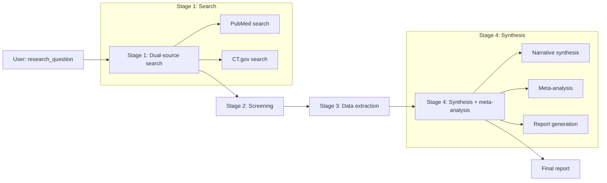

# SLR-Meta Agent Design

## Purpose

Systematic literature review and meta-analysis agent that uses **PubMed** and **ClinicalTrials.gov** to identify and synthesize clinical evidence for a given research question, including quantitative meta-analysis when appropriate.

## Architecture

### Pattern

**Multi-stage pipeline** (LangGraph StateGraph) with four stages: Search → Screening → Extraction → Synthesis. Each stage can involve multiple LLM + tool loops before transitioning to the next.

### Workflow (Mermaid)

### State (SLRMetaAgentState)

| Field | Purpose |
|-------|---------|
| `messages` | Conversation history |
| `research_question`, `target_outcomes` | Input |
| `identified_studies`, `ctgov_trials` | From Stage 1 (PubMed + CT.gov) |
| `search_summary` | Search stage summary |
| `eligibility_criteria`, `included_studies`, `excluded_studies` | From Stage 2 |
| `study_extractions`, `extraction_summary` | From Stage 3 |
| `final_report`, `evidence_synthesis` | From Stage 4 |

### Tools

| Tool | Source | Purpose |
|------|--------|---------|
| `pubmed_search` | TrialMind-SLR | Search PubMed with Boolean queries |
| `fetch_abstracts` | TrialMind-SLR | Fetch abstracts by PMIDs |
| `ctgov_search` | New (slr_meta/tools.py) | Search ClinicalTrials.gov (conditions, terms, interventions) |
| `generate_eligibility_criteria` | TrialMind-SLR | Generate PICO-based criteria |
| `screen_study` | TrialMind-SLR | Screen one study against criteria |
| `extract_study_data` | TrialMind-SLR | Extract structured data from abstract |
| `synthesize_evidence` | TrialMind-SLR | Narrative synthesis template |
| `meta_analysis` | New (slr_meta/tools.py) | Meta-analysis framework (pooled estimate, heterogeneity) |
| `generate_slr_report` | TrialMind-SLR | Final PRISMA-style report template |

### Input / Output

- **Input**: `research_question` (str), optional `target_outcomes` (list of str).
- **Output**: `SLRMetaExecutionResults` with `final_report` (markdown), `identified_pubmed`, `identified_ctgov`, `included_studies`, and full message history.

## Implementation notes

- CT.gov search is synchronous (uses `asyncio.run(search_trials(...))` inside the tool).
- Parsing of PubMed and CT.gov tool outputs populates `identified_studies` and `ctgov_trials` for downstream stages.
- Meta-analysis is guidance/template-based (no statistical library); the LLM fills in pooled estimates and heterogeneity when data are provided in extracted form.
